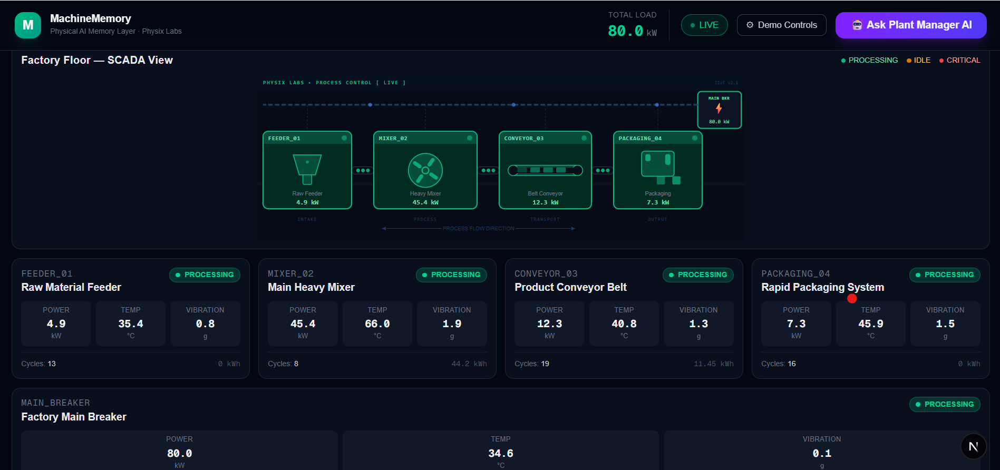

# 🏭 MachineMemory.physixlabs.com

### *Physical AI Memory Layer for Industrial Machines*

> Built for the [Supermemory Local Hackathon](https://discord.com/invite/WtkvM62fHK) · localhost:6767 · July 9–13, 2026

---

## 🧠 What if factories had memory?

Every second, industrial machines generate thousands of sensor readings — temperature, vibration, power draw, cycle counts, and more.

**The problem isn't the lack of data. It's that AI can't remember what actually happened.**

Current industrial systems store endless time-series logs, forcing engineers to manually correlate events across dashboards, alarms, and historians to answer questions like:

- *Why did energy usage spike at 2 AM?*
- *What caused this machine failure?*
- *Has this fault pattern happened before?*
- *Which event triggered the chain reaction downstream?*

Dumping raw JSON telemetry into an LLM doesn't work either — it blows the context window, costs a fortune in tokens, and still can't reason across time.

**That's exactly what MachineMemory solves.**

---



---

## 🤖 AI Plant Manager Agent


The agent uses a two-step retrieval-augmented generation (RAG) pipeline:

Instead of storing every raw sensor value, MachineMemory transforms machine telemetry into meaningful **episodic memories**.

Our statistical middleware continuously monitors live telemetry, detects **state transitions**, **>3σ anomalies**, and **cross-machine energy correlations** — then converts them into human-readable operational memories:

> *"Conveyor_03 entered a CRITICAL overload state at 10:42 AM. Motor vibration reached 4.8g while power consumption surged to 30kW — 2.5× above baseline — causing a downstream production bottleneck."*

These memories are stored in **Supermemory Local** (`localhost:6767`), giving the AI Plant Manager long-term episodic context instead of a firehose of raw numbers.

Now operators can simply ask:

```
💬 "What faults occurred in the last hour?"
💬 "Why did our energy consumption increase?"
💬 "Which machine is becoming a maintenance risk?"
```

…and receive contextual answers with **machine IDs, timestamps, sigma deviations, correlated events, and root-cause reasoning** — all grounded in real operational history.

---

## 🏗️ Architecture

```
[ Factory Simulator ]  ──►  [ Statistical Middleware ]  ──►  [ Supermemory Local ]  ──►  [ AI Agent + UI ]
   Node.js · 5 assets         >3σ filter · state shifts        localhost:6767              Groq LLM · Next.js
   telemetry every 1.5s       semantic string formatter         vector + fact store         Plant Manager chat
```

### How the memory layer works

Raw telemetry never touches the LLM. The middleware applies three rules:

| Rule | Trigger | Example Memory |
|------|---------|---------------|
| **State Shift** | Machine status changes | *"mixer_02 transitioned from IDLE to PROCESSING. Load stabilized at 45.2kW."* |
| **Anomaly Spike** | Metric exceeds >3σ from running baseline | *"feeder_01 Power Draw spiked to 5.97kW (baseline 5.08kW, 3.2σ deviation)."* |
| **Cross-Asset Correlation** | Anomaly coincides with >20% main breaker surge | *"Main Breaker registered 115kW surge, directly correlating with conveyor_03 mechanical stress event."* |

---

## 🏭 Simulated Production Line

**Process flow:** `feeder_01` → `mixer_02` → `conveyor_03` → `packaging_04` → `main_breaker`

| Machine | ID | Baseline Power | Role |
|---------|-----|---------------|------|
| Raw Material Feeder | `feeder_01` | 5 kW | Pushes raw inputs downstream |
| Main Heavy Mixer | `mixer_02` | 45 kW | Energy-intensive processing |
| Product Conveyor Belt | `conveyor_03` | 12 kW | Transports processed output |
| Rapid Packaging System | `packaging_04` | 8 kW | Boxes finished items |
| Factory Main Breaker | `main_breaker` | Dynamic | Macro energy demand monitor |

A fault early in the chain bubbles downstream — exactly mirroring real industrial behavior.

---

## ⚡ Three Live Demo Scenarios

Trigger real faults from the UI control panel and watch the memory layer respond in real time:

### ⚡ Energy Leak — `feeder_01`
The feeder completes its batch but stays stuck in IDLE state, drawing 5kW continuously with zero productive output. The memory layer detects the idle waste and stores it as an operational defect.

### 🔴 Conveyor Jam — `conveyor_03`
Mechanical jam forces: **30kW draw** (2.5× baseline), **88°C temperature**, **4.8g vibration**. The main breaker simultaneously surges. A correlated multi-asset memory is generated.

### 🔧 Maintenance Alert — `mixer_02`
Accelerates the mixer's cumulative energy counter past its **5,000 kWh service threshold**, triggering a predictive maintenance memory before a failure occurs.

---

The agent uses a two-step retrieval-augmented generation (RAG) pipeline:

1. **Search** — Hybrid vector + keyword search over Supermemory Local memories
2. **Reason** — Groq LLM (llama-3.1-8b-instant) synthesizes findings into technical diagnostics

**System prompt:**
> *"You are the MachineMemory Plant Manager Agent. Provide highly technical, objective, and mathematically grounded diagnostics. Always cross-reference machine anomalies with structural energy footprints. Avoid conversational pleasantries."*

**Try this query after running all three scenarios:**
> *"Analyze our floor energy consumption and machine behavior logs from the past hour. Identify all operational inefficiencies and structural faults."*

---

## 🛠️ Tech Stack

| Layer | Technology |
|-------|-----------|
| Memory store | **Supermemory Local** (self-hosted, `localhost:6767`) |
| Embeddings | Xenova/bge-base-en-v1.5 · 768d · fully local |
| LLM | Groq · `llama-3.1-8b-instant` (agent chat + memory extraction) |
| Backend | Node.js · Express · Socket.io |
| Frontend | Next.js 16 · Tailwind CSS · Turbopack |
| Simulator | Custom Node.js factory simulation engine |
| Containerization | Docker Compose |

---

## 🚀 Quick Start

### Prerequisites
- Node.js v18+
- Docker Desktop
- Free [Groq API key](https://console.groq.com) (starts with `gsk_`)

### 1. Clone & configure environment

```bash
git clone https://github.com/YOUR_USERNAME/physixlabs-supermemory-hackathon.git
cd physixlabs-supermemory-hackathon
```

Copy and fill the environment files:

```bash
# Root .env (used by Docker Compose for memory extraction LLM)
echo "GROQ_API_KEY=gsk_your_key_here" > .env

# Backend
cp backend/.env.example backend/.env
# Edit backend/.env — paste your SM_API_KEY after step 2

# UI
cp ui/.env.example ui/.env.local
# Edit ui/.env.local — same SM_API_KEY + GROQ_API_KEY
```

### 2. Start Supermemory Local

```bash
docker compose up supermemory
```

Wait ~20 seconds for:
```
> supermemory ready
  url  http://localhost:6767
  api key  sm_xxxxxxxxxxxxxxxxxxxx   ← copy this
```

Paste the `sm_...` key into `backend/.env` and `ui/.env.local`.

### 3. Start the backend

```bash
node backend/index.js
```

Expected:
```
✅  Backend    → http://localhost:3001
🧠  Supermemory → http://localhost:6767 [ENABLED]
📡  Socket.io   → Ready for UI connections
```

### 4. Start the UI

```bash
cd ui
npx next dev
```

Open **http://localhost:3000**

---

## 📁 Project Structure

```
physixlabs-supermemory-hackathon/
├── docker-compose.yml          # Supermemory Local service
├── Dockerfile.supermemory      # Custom Supermemory image
├── backend/
│   ├── index.js                # Express server + Socket.io + REST routes
│   ├── middleware/
│   │   ├── anomalyDetector.js  # >3σ statistical anomaly detection
│   │   ├── correlator.js       # Cross-asset energy correlation
│   │   ├── stateCache.js       # Rolling baseline stats per machine
│   │   └── supermemoryClient.js# Supermemory SDK: push, search, seed
│   └── simulator/
│       ├── machines.js         # Machine configs and baselines
│       ├── scenarios.js        # Three scripted fault injectors
│       └── simulator.js        # Factory simulation loop
└── ui/
    ├── app/
    │   ├── page.tsx            # Control room dashboard
    │   └── api/agent/route.ts  # Agent: Supermemory search → Groq LLM
    ├── components/
    │   ├── FactoryLayout.tsx   # SVG factory floor map
    │   ├── MachineCard.tsx     # Live telemetry card per machine
    │   ├── EventLog.tsx        # Real-time memory event feed
    │   ├── AgentChat.tsx       # Plant Manager AI chat
    │   └── ScenarioPanel.tsx   # Fault scenario trigger controls
    └── lib/socket.ts           # Socket.io client
```

---

## 🔍 Verify Stored Memories

```bash
curl -X POST http://localhost:3001/api/search \
  -H "Content-Type: application/json" \
  -d '{"query": "machine fault anomaly energy", "limit": 10}'
```

Or in PowerShell:
```powershell
Invoke-RestMethod -Uri "http://localhost:3001/api/search" `
  -Method POST -ContentType "application/json" `
  -Body '{"query":"conveyor jam critical fault","limit":5}' | ConvertTo-Json -Depth 4
```

---

## 🌱 Why This Matters

While most AI memory projects focus on remembering **conversations or documents**, MachineMemory asks a different question:

**Can physical machines have memory too?**

This is our first step toward giving factories a searchable operational memory that AI can reason over — where a plant engineer can ask a natural language question and get back a technically grounded answer rooted in real machine history.

The pattern — *filter noise → extract semantic events → store episodic memories → enable RAG over physical-world context* — is reusable across any sensor-heavy domain: energy grids, autonomous vehicles, smart buildings, medical devices.

---

## 📄 License

MIT — build freely, ship boldly.

---

*Built with ❤️ by Physix Labs · Supermemory Local Hackathon 2026*

